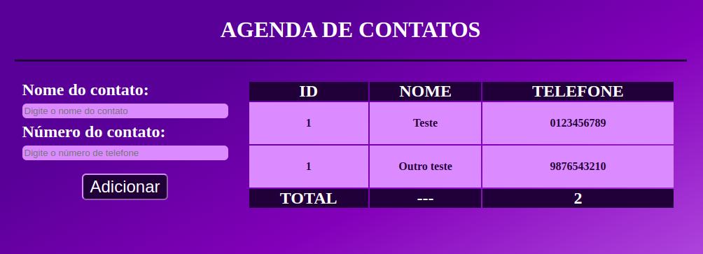

<h1 align="center">
    <a href="#" alt="...">Agenda de contatos</a>
</h1>

<h3 align="center">

    Agenda de contatos para organização. 

</h3>

  
  
  
   
   
  

<h4 align="center">
	🚧 STATUS: Projeto não finalizado  🚧
</h4>

## 💻 Sobre o projeto

Bem-vindo à "Agenda de Contatos", uma aplicação web desenvolvida para ajudá-lo a gerenciar seus contatos de forma simples e eficiente. 
A agenda de contatos foi um desafio do curso **Engenheiro Front-End** da escola **EBAC**, ao qual eu faço parte.

Esta aplicação foi projetada com o objetivo de colocar em prática a interação do JavaScript com as páginas em HTML.
Foi o primeiro projeto que realizei deste tipo. 

## ⚙️ Estrutura do projeto

- O projeto é composto por:
  - Página HTML principal: **(main.html)**
  - Um arquivo CSS para estilização: **index.css**
  - Um arquivo JS para adicionar lógica e interação do usuário com a página: **index.js**
  - Uma pasta **(assets)** com as imagens utilizadas na construção da página web.

## 🎲 Funcionalidades

As funcionalidades desenvolvidas no projeto foram:

- [x] **Cadastro de Contatos**: Permite ao usuário cadastrar novos contatos inserindo seus nomes e números de telefone através de um formulário.

- [x] **Validação de Dados**: Verifica se o nome ou número de telefone já foram adicionados anteriormente à agenda. Caso positivo, exibe um alerta informando ao usuário que o contato já existe.

- [x] **Exibição dos Contatos**: Após adicionar um novo contato, atualiza dinamicamente a tabela na página exibindo o nome e número do contato adicionado.

- [x] **Atualização do Total de Contatos**: Mantém atualizado o total de contatos cadastrados na agenda, exibindo-o na parte inferior da tabela.

- [x] **Estilo Visual Atraente**: Utiliza um esquema de cores harmonioso e uma disposição organizada dos elementos na página para uma experiência de usuário agradável.

- [x] **Responsividade**: O layout da página é responsivo e se adapta a diferentes tamanhos de tela, garantindo uma boa experiência de uso em dispositivos móveis e desktops.

- [x] **Estilo de Formulário**: Apresenta um formulário estilizado com campos de entrada para nome e número de telefone, além de um botão de submissão com design atraente.

- [x] **Estilo de Tabela**: Utiliza uma tabela estilizada para exibir os contatos cadastrados, com cabeçalho e rodapé destacados visualmente.

- [x] **Estilo de Alerta**: Exibe alertas visuais ao usuário em caso de erro durante a inserção de novos contatos, garantindo uma comunicação eficaz das mensagens de feedback.

## 🛠 Tecnologias

Foi utilizado na construção do projeto as seguintes tecnologias:

<code></code> **HTML**
<code></code> **CSS**
<code></code> **JavaScript**
<code></code> **Git**
<code></code> **GitHub**

## ✈️ Acesse a Página

Este projeto encontra-se hospedado na plataforma da [Vercel](https://vercel.com/).

#### Pode ser visualizado clicando aqui: [Agenda de contatos - JS](https://agenda-de-contatos-theta-gold.vercel.app/)

## 👀 Visualizando a Página

Abaixo é possível visualizar a página web desenvolvida:

## 🦸 Autor

<a href="https://github.com/bcadore">
    
     
    <b>Bernardo Cadore Ramires</b>
</a>

 

## 📝 Licença

Este projeto esta sobe a licença [MIT](./LICENSE).

## ⚠️ Outras considerações

👉 **Este projeto é parte de uma tarefa educacional, mas sinta-se à vontade para fornecer feedback ou sugestões de melhorias.**
 

❤️  <b>MUITO OBRIGADO</b> por visitar o meu projeto! ❤️

---